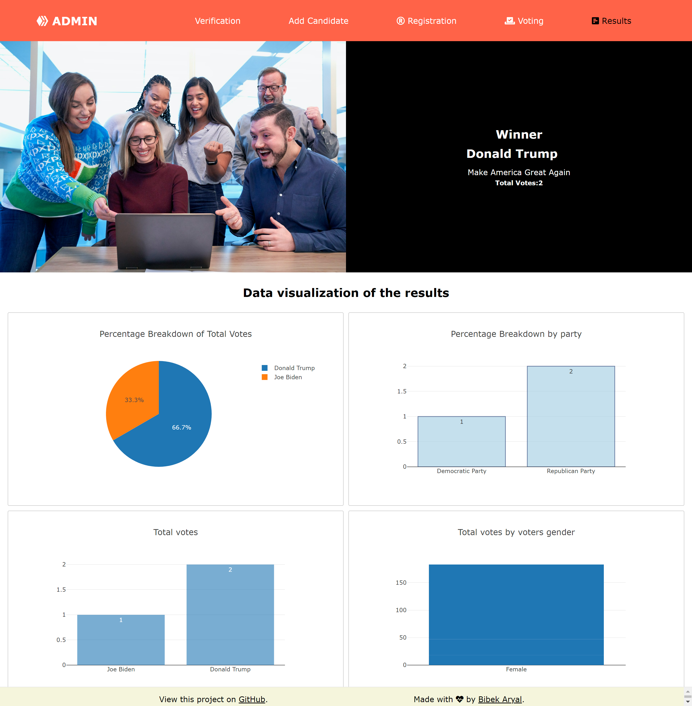

# Decentralised Voting (dVoting)

A decentralised voting system based on [Ethereum blockchain](https://ethereum.org/dapps/) technology.

> This started as a final year project for the IT Degree that I was/am pursuing, now aiming to make this more than that.

## System Workflow

A brief explanation on the basic workflow of the application.

- Admin will create a voting instance by launching/deploying the system in a blockchain network (EVM), then create an election instance and start the election with the details of the election filled in (including candidates for voters to vote).
- Then the likely voters connect to the same blockchain network register to become a voter. Once the users successfully register, their respective details are sent/displayed in the admins' panel (i.e. verification page).
- The admin then will check if the registration information (blockchain account address, name, and phone number) is valid and matches with his record. If yes, then the admin approves the registered user making them eligible to take part and cast their respective vote in the election.
- The registered user (voter) following the approval from the admin casts their vote to the candidate of interest (from the voting page).
- After some time, depending on the scale of the election the admin ends the election. As that happens the voting is closed and the results are displayed announcing the winner at the top of the results page.

  **See demo [here](https://youtu.be/nh1zfTTrdII "Watch dVoting demo").**

---

## Setting up the development environment

### Requirements

- [Node.js](https://nodejs.org)
- [Truffle](https://www.trufflesuite.com/truffle)
- [Ganache](https://github.com/trufflesuite/ganache-cli) (Cli)
- [Metamask](https://metamask.io/) (Browser Extension)

#### Getting the requirements

1. Download and install **NodeJS**

   Download and install NodeJS from [here](https://nodejs.org/en/download/ "Go to official NodeJS download page.").
2. Install **truffle** and **ganache-cli** using node packager manager (npm)

   ```shell
   npm install -g truffle
   npm install -g ganache-cli
   ```
3. Install **metamask** browser extension

   Download and install metamask from [here](https://metamask.io/download "Go to official metamask download page.").

### Configuring the project for development

1. Clone this repository

   ```shell
   git clone https://github.com/arlbibek/dVoting.git
   cd dVoting
   ```
2. Run local Ethereum blockchain

   ```shell
   ganache-cli
   ```

   > Note: Do not close `ganache-cli` (the blockchain network needs to be running all the time)
   >
3. Configure metamask on the browser with the following details

   New RPC URL: `http://127.0.0.1:8545` *(use `port: 7545` for **ganache gui**, update it in the file:`truffle-config.js` as well)*

   Chain ID: `1337`
4. Import account(s) using private keys from ganache-cli to the metamask extension on the browser
5. Deploy smart contract to the (local) blockchain network (i.e ganache-cli)

   ```shell
   # on the dVoting directory
   truffle migrate
   ```

   > Note: Use `truffle migrate --reset` for re-deployments
   >
6. Launch the development server (frontend)

   ```shell
   cd client
   npm install
   npm start
   ```

   > If you encounter **error** during `npm install`, please note that you might need to install Microsoft Visual C++ Redistributable packages from [learn.microsoft.com/en-us/cpp/windows/latest-supported-vc-redist](https://learn.microsoft.com/en-us/cpp/windows/latest-supported-vc-redist?view=msvc-170) (here is the direct download link for X64: [aka.ms/vs/17/release/vc_redist.x64.exe](https://aka.ms/vs/17/release/vc_redist.x64.exe))
   >

## To-Do List

Possible features to add/improve within the app.

- [ ] **Email Verification**—adding email/phone verification (OTP, etc..) while registering for voters.
- [ ] **Automated Verification**—adding an automated verification (rather than manually approving by the admin) for the registered users. This could be based on the custom cooperation email, custom list of emails, or custom list of phone numbers, etc.
- [X] **Report**—option to generate a report at the end of an election. The report could contain a range of information including the number of people that were eligible to vote, the number of people that participated in the election, a bar-chart/pie-chart showing the election statistics, etc.
- [ ] **Workflow improvements**—overall workflow improvements (eg. option to add candidates within the election setup page), with overall GUI improvements.
- [ ] **Multiple election instance**—ability to create multiple election instances without having to re-deploy the smart contract.

## Changes Made on This Repository

1. Updated: Voter Registration Page User Interface and Added Age and Gender Input Fields
2. Updated: Admin Registration Page, Added Party Input Fields
3. Updated: Results Page, Converted Results to Data Visualization Report
4. Updated: NPM Commands to Run Required Tasks Simultaneously

see screenshoots:



## Join us on Discord

[](https://discord.gg/3jmfdNsHWr)

[discord.gg/3jmfdNsHWr](https://discord.gg/3jmfdNsHWr "Join us on Discord!")

---

Made with ❤️ by [Bibek Aryal](https://bibeka.com.np/).
